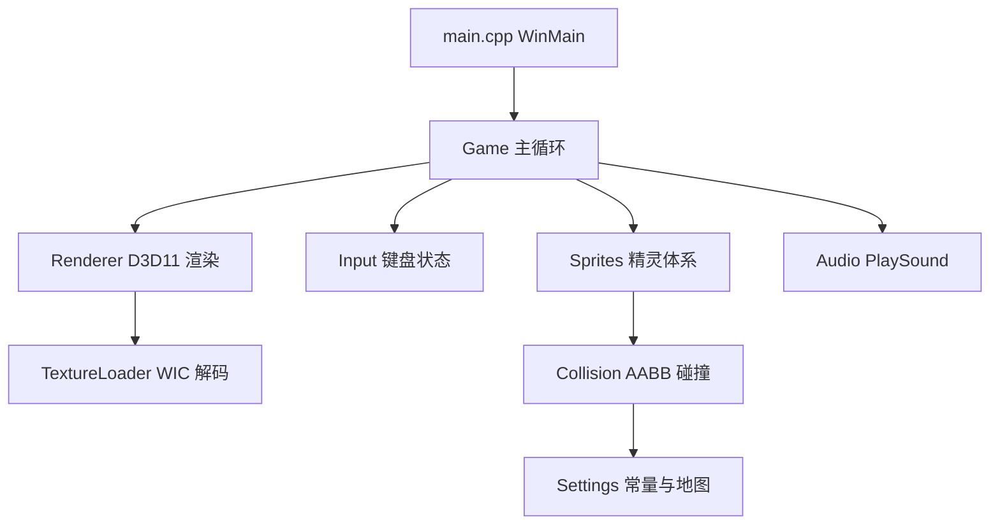

## 产品概述

将 Python/pygame 版《坦克大战》（源目录 `TankGame/TankWar/`）完整转写为 C++ 桌面游戏，渲染层使用本机可用的 DirectX 11（Windows SDK 内置，无需旧版 June 2010 SDK）。所有源码、构建脚本、代码功能分析与转写文档均输出到 `TankGame-CodeBuddy/` 目录，可直接用本机 CMake + MSVC 构建运行。

## 核心功能

- 我方坦克：方向键控制上/下/左/右移动，空格键发射子弹，最多 3 发同时存在。
- 敌方坦克 AI：5 辆敌方坦克随机方向移动、随机转向、随机射击（约 1/60 概率）。
- 地图与墙体：13×19 网格地图，支持红砖墙（可摧毁、需 2 次命中）、铁墙（不可摧毁）、草丛（可穿越、遮挡坦克）、老巢（被击中即游戏结束）。
- 碰撞检测：子弹击中墙体/坦克、坦克碰撞墙体/坦克的矩形碰撞判定，含把坦克推出墙体的回退处理。
- 爆炸动画与音效：墙体/坦克销毁时播放 8 帧爆炸动画，射击/爆炸播放 WAV 音效。
- 游戏结束条件：我方坦克死亡或老巢被摧毁即结束。

## 技术栈

- 语言与编译器：C++17，MSVC 14.51（Visual Studio 18 Community，`cl.exe` 已确认存在）。
- 构建系统：CMake（`C:\Program Files\CMake\bin\cmake.exe`），使用默认 Visual Studio 生成器（本机无 ninja）。
- 图形 API：DirectX 11（Windows SDK 10.0.26100.0 内 `d3d11.h`、`d3dcompiler.h`、`dxgi.h` 及对应 `.lib` 均已确认存在）。
- 图片解码：WIC（Windows Imaging Component，GIF 取首帧、PNG 解码为 BGRA）。
- 音频：PlaySound（`winmm.lib`）。
- 窗口与输入：Win32 API（`user32.lib`、`gdi32.lib`）。

选择 DirectX 11 的理由：本机未安装旧版 `Microsoft DirectX SDK (June 2010)`，但 Windows SDK 已完整内置 DirectX 11 开发能力，因此按用户优先级直接采用 DirectX 11，无需降级到 OpenGL/Vulkan/GDI/GDI+。

## 实现方案

整体策略：以 pygame 原逻辑为蓝本做 1:1 行为等价移植；用 Win32 窗口 + D3D11 渲染循环替换 pygame 的窗口/渲染/输入/音频，用 C++ 类继承体系替换 Python 精灵继承体系。

关键决策：

- 使用正交投影，顶点坐标直接采用像素坐标（左上原点，950×650），与 pygame 坐标系完全一致。
- 每个精灵渲染为一个带纹理的四边形（两个三角形），顶点含 position + uv。
- HLSL 着色器以字符串内嵌于 Renderer 中，运行时用 `D3DCompile` 编译，避免外部 shader 文件路径问题。
- 原版爆炸动画使用「线程 + time.sleep 逐帧加载」，转写为基于帧计时器的非阻塞动画（累计时间按帧间隔推进 blast1~blast8），避免阻塞主循环。
- 以 60 FPS 帧限流（等价 `clock.tick(60)`），使用 `QueryPerformanceCounter` 或 `Sleep` 对齐帧间隔。
- 严格保持原版渲染叠放顺序：敌弹 → 敌坦克 → 我弹 → 我坦克 → 墙（草绘制在坦克之上，形成隐蔽效果）。

## 架构设计



模块划分：

- **Renderer**：D3D11 设备/交换链初始化、HLSL 编译、纹理 SRV 缓存、`DrawSprite` 四边形绘制。
- **TextureLoader**：WIC 工厂，`CreateDecoderFromFilename` 解码图片并创建 `ID3D11ShaderResourceView`。
- **Sprites**：`BaseSprite`/`Bullet`/`TankSprite`/`Hero`/`Enemy`/`Wall`，对应 `sprites.py` 的类继承关系。
- **Game**：地图构建、输入处理、碰撞检测、更新与渲染循环、胜负判定，对应 `tank_war.py`。
- **Audio**：`PlaySound` 封装（fire/boom/hit，使用 `SND_ASYNC`）。
- **Settings**：常量、方向枚举、`MAP_ONE` 地图、资源路径，对应 `settings.py`。

## 目录结构

```
TankGame-CodeBuddy/
├── CMakeLists.txt                    # [NEW] 构建脚本，链接 d3d11/d3dcompiler/dxgi/winmm/windowscodecs
├── README.md                         # [NEW] 构建与运行说明
├── docs/
│   ├── 代码功能分析.md                 # [NEW] Python 各文件/类/函数到 C++ 的功能映射分析
│   └── 转写说明.md                     # [NEW] 转写决策、与原版差异、资源说明
├── src/
│   ├── main.cpp                      # [NEW] WinMain 入口，创建窗口并进入 Game 循环
│   ├── Settings.h                    # [NEW] 常量、Direction 枚举、MAP_ONE、资源路径
│   ├── Rect.h                        # [NEW] 矩形结构体及相交判定辅助函数
│   ├── TextureLoader.h/.cpp          # [NEW] WIC 图片解码，GIF 取首帧
│   ├── Renderer.h/.cpp               # [NEW] D3D11 设备/交换链/着色器/精灵绘制
│   ├── Audio.h/.cpp                  # [NEW] PlaySound 音效播放封装
│   ├── Sprites.h/.cpp                # [NEW] BaseSprite/Bullet/TankSprite/Hero/Enemy/Wall
│   └── Game.h/.cpp                   # [NEW] 地图、输入、碰撞、更新、渲染主循环
└── resources/                        # [COPY] 从 TankGame/TankWar/resources 复制全部资源
```

## 实现要点

- 敌人生成：原版未初始化敌方坐标，5 辆坦克会重叠在 (0,0)；转写时按索引将敌方分配到屏幕顶部（y=0、x 均匀分布），并在 `转写说明.md` 中标注该差异。
- 空格键：`WM_KEYDOWN` 存在按键重复，需仅在「未按下→按下」边沿触发一次 `shot()`，避免按住空格连发。
- 碰撞：使用 AABB 矩形相交；红砖墙 `life=2`（两发子弹摧毁），铁墙不摧毁，老巢被击中置 `game_still=false`。
- 方向移动：LEFT/RIGHT 修改 x，UP/DOWN 修改 y，与 pygame 一致；碰撞后按方向将坦克推出墙体（+2px）。
- 资源路径：构建后保证 `resources` 与可执行文件相对路径一致，并在程序启动时将工作目录处理为 exe 所在目录。
- 错误处理：窗口、D3D11 设备、纹理加载失败时用 `MessageBox` 给出可操作错误信息并返回非零退出码，避免静默失败。